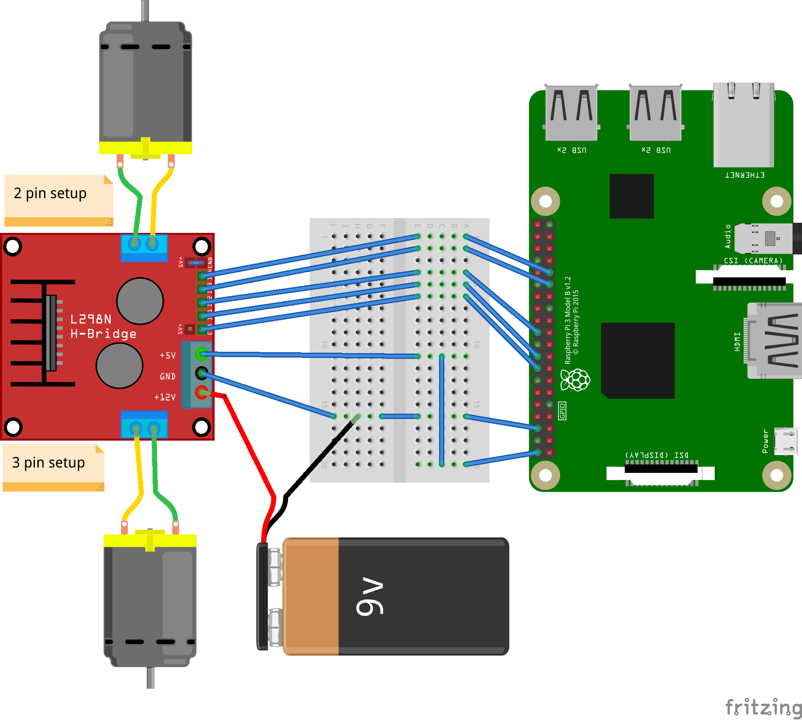

# DC Motor Controller sample


[Fritzing diagram](dcmotor.fzz)

[See full sample](Program.cs)

```csharp
        static DCMotorSettings TwoPinModeAutoPwm()
        {
            // this will use software PWM on one of the pins
            return new DCMotorSettings()
            {
                Pin0 = 24,
                Pin1 = 23, // for 1 pin mode don't set this and connect your pin to the ground
                UseEnableAsPwm = false,
            };
        }

        static DCMotorSettings TwoPinModeManualPwm()
        {
            return new DCMotorSettings()
            {
                Pin0 = 23,
                UseEnableAsPwm = false,
                PwmController = new PwmController(new SoftPwm()),
                PwmChip = 24,
                // PwmChannel = 0, // use for hardware PWM
                PwmFrequency = 50, // optional, defaults to 50
            };
        }

        static DCMotorSettings ThreePinMode()
        {
            return new DCMotorSettings()
            {
                Pin0 = 27,
                Pin1 = 22,
                PwmController = new PwmController(new SoftPwm()),
                PwmChip = 17,
                //PwmChannel = 1, // use for hardware PWM
                PwmFrequency = 50, // optional, defaults to 50
            };
        }

        static void Main(string[] args)
        {
            const double Period = 10.0;
            DCMotorSettings settings = ThreePinMode();
            Stopwatch sw = Stopwatch.StartNew();
            using (DCMotor motor = DCMotor.Create(settings))
            {
                double time = sw.ElapsedMilliseconds / 1000.0;
                // Note: range is from -1 .. 1 (for 1 pin setup 0 .. 1)
                motor.Speed = Math.Sin(2.0 * Math.PI * time / Period);
            }
        }
```
